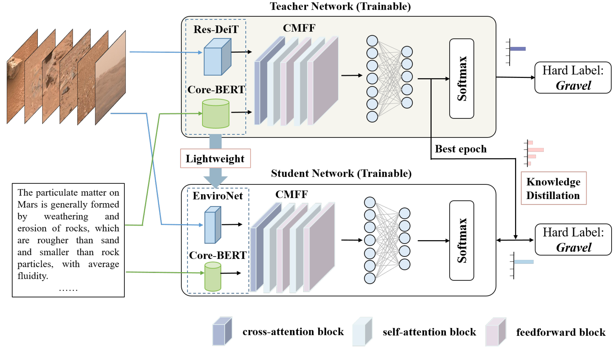
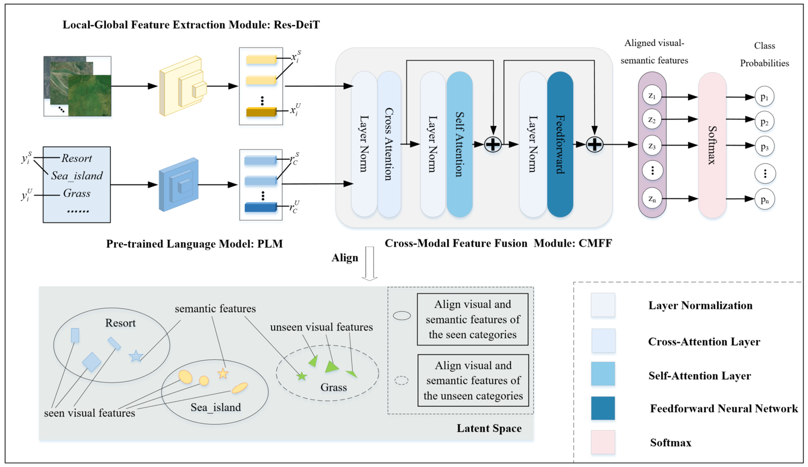
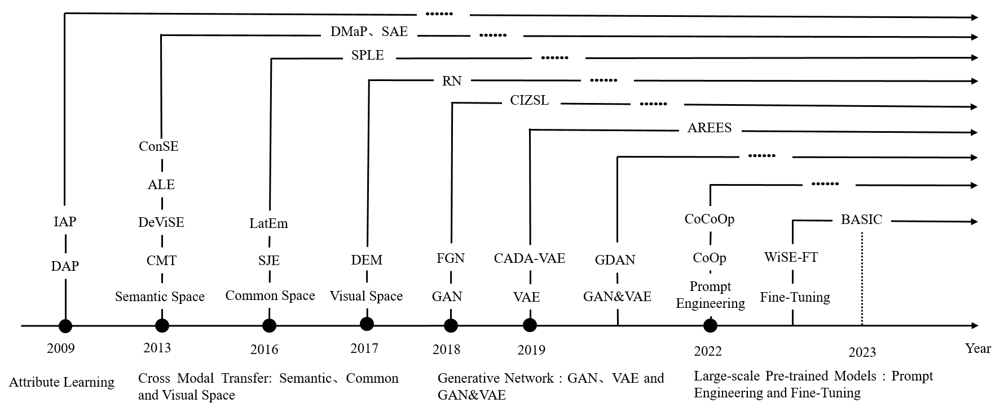

## Zero-shot scene classification

<table width="100%" class="imgtable"><tbody><tr><td width="306"></td><td><a href="https://ieeexplore.ieee.org/document/10699382">A Lightweight Framework With Knowledge Distillation for Zero-Shot Mars Scene Classification</a> <b>Xiaomeng Tan</b>, Bobo Xi*, Haitao Xu, Jiaojiao Li, Yunsong Li, Changbin Xue, Jocelyn Chanussot,  <i> IEEE Transactions on Geoscience and Remote Sensing, (<b>TGRS</b>)</i>, 2024. (<b>SCI Q1 Top, IF=8.2</b>) [<a href="https://ieeexplore.ieee.org/document/10699382">Paper</a>][<a href="https://github.com/XM-Tan/KDMSC">Code</a>]</td></tr></tbody></table>   

<table width="100%" class="imgtable"><tbody><tr><td width="306"></td><td><a href="https://ieeexplore.ieee.org/document/10557622">MFINet: A Novel Zero-Shot Remote Sensing Scene Classification Network Based on Multimodal Feature Interaction</a> <b>Xiaomeng Tan</b>, Bobo Xi*, Haitao Xu, Yunsong Li, Changbin Xue, Jocelyn Chanussot,  <i> IEEE Journal of Selected Topics in Applied Earth Observations and Remote Sensing, (<b>JSTARS</b>)</i>, 2024. (<b>SCI Q2 Top, IF=4.7</b>) [<a href="https://ieeexplore.ieee.org/document/10557622">Paper</a>][<a href="https://github.com/XM-Tan/MFINet">Code</a>]</td></tr></tbody></table>   

<table width="100%" class="imgtable"><tbody><tr><td width="306"></td><td><a href="https://ieeexplore.ieee.org/document/10552052">Review of Zero-Shot Remote Sensing Image Scene Classification</a> <b>Xiaomeng Tan</b>, Bobo Xi*, Jiaojiao Li, Tie Zheng, Yunsong Li, Changbin Xue, Jocelyn Chanussot,  <i> IEEE Journal of Selected Topics in Applied Earth Observations and Remote Sensing, (<b>JSTARS</b>)</i>, 2024. (<b>SCI Q2 Top, IF=4.7</b>) [<a href="https://ieeexplore.ieee.org/document/10552052">Paper</a>][<a href="https://github.com/XM-Tan/Review-for-ZSRSSC">Code</a>]</td></tr></tbody></table>  
